# RAG系统异步设计架构文档

## 📋 目录
- [系统概览](#系统概览)
- [异步架构设计](#异步架构设计)
- [核心组件详解](#核心组件详解)
- [事件循环管理机制](#事件循环管理机制)
- [向量存储异步策略](#向量存储异步策略)
- [FastAPI集成模式](#fastapi集成模式)
- [LangGraph工作流设计](#langgraph工作流设计)
- [异步问题与解决方案](#异步问题与解决方案)
- [性能优化策略](#性能优化策略)
- [最佳实践](#最佳实践)

---

## 🎯 系统概览

### 整体架构图

```mermaid
graph TB
    %% 客户端层
    Client[🌐 客户端请求] --> FastAPI[⚡ FastAPI Server]
    
    %% API层
    FastAPI --> KnowledgeAPI[📚 Knowledge Base API]
    FastAPI --> HealthCheck[💚 Health Check]
    FastAPI --> ModelInfo[🤖 Model Info]
    
    %% 中间件层
    FastAPI --> ProcessTime[⏱️ Process Time Middleware]
    FastAPI --> ModelInit[🔧 Model Init Middleware]
    FastAPI --> CORS[🌍 CORS Middleware]
    
    %% 核心服务层
    KnowledgeAPI --> KBManager[📊 Knowledge Base Manager]
    KBManager --> DocProcessor[📄 Document Processor]
    KBManager --> VectorManager[🔍 Vector Store Manager]
    
    %% 文档处理增强层
    DocProcessor --> ChunkingFactory[🧠 Chunking Strategy Factory]
    ChunkingFactory --> RecursiveStrategy[📝 递归分块策略]
    ChunkingFactory --> TokenStrategy[🔢 Token分块策略]
    ChunkingFactory --> SemanticStrategy[🧪 语义分块策略]
    ChunkingFactory --> CodeStrategy[💻 代码分块策略]
    ChunkingFactory --> FormatStrategy[📋 格式特定策略]
    
    %% 异步工具层
    VectorManager --> AsyncUtils[⚙️ Async Loop Manager]
    DocProcessor --> StrategyRecommender[🎯 策略推荐器]
    
    %% 模型层
    VectorManager --> EmbeddingModel[🧠 Embedding Model]
    VectorManager --> VectorStore[🗄️ Milvus Vector Store]
    
    %% 工作流层
    subgraph RAGWorkflow [🔄 RAG Workflow - LangGraph]
        QueryAnalyzer[🔍 Query Analyzer]
        RetrievalRouter[🛤️ Retrieval Router]
        KnowledgeRetriever[📚 Knowledge Retriever]
        WebSearcher[🌐 Web Searcher]
        InfoFusion[🔀 Information Fusion]
        ContextBuilder[📝 Context Builder]
        ResponseGenerator[💬 Response Generator]
    end
    
    %% 存储层
    VectorStore --> Milvus[(🗃️ Milvus Database)]
    KBManager --> FileSystem[(📁 File System)]
    
    %% 样式
    classDef asyncComponent fill:#e1f5fe,stroke:#0277bd,stroke-width:2px
    classDef middleware fill:#f3e5f5,stroke:#7b1fa2,stroke-width:2px
    classDef storage fill:#e8f5e8,stroke:#388e3c,stroke-width:2px
    classDef workflow fill:#fff3e0,stroke:#f57c00,stroke-width:2px
    
    class AsyncUtils,VectorManager,KBManager,DocProcessor asyncComponent
    class ProcessTime,ModelInit,CORS middleware
    class Milvus,FileSystem storage
    class RAGWorkflow,QueryAnalyzer,RetrievalRouter,KnowledgeRetriever,WebSearcher,InfoFusion,ContextBuilder,ResponseGenerator workflow
```



### 技术栈

- **Web框架**: FastAPI (异步ASGI)
- **异步运行时**: Python asyncio
- **向量数据库**: Milvus (支持异步操作)
- **LLM框架**: LangChain + LangGraph
- **文档处理**: LangChain Document Loaders + 模块化分块策略
- **嵌入模型**: OpenAI Embeddings / DashScope Embeddings
- **分块策略**: 递归、Token、语义、字符、代码、格式特定策略

---

## 🏗️ 异步架构设计

### 分层异步架构

```mermaid
graph TD
    %% 请求层
    subgraph RequestLayer [🌐 请求处理层]
        HTTPRequest[HTTP 请求]
        FastAPIRouter[FastAPI Router]
        AsyncMiddleware[异步中间件]
    end
    
    %% 服务层
    subgraph ServiceLayer [⚙️ 服务处理层]
        KnowledgeService[知识库服务]
        DocumentService[文档处理服务]
        VectorService[向量存储服务]
    end
    
    %% 工作流层
    subgraph WorkflowLayer [🔄 工作流层]
        RAGStateMachine[RAG状态机]
        AsyncNodes[异步节点]
        ConditionalEdges[条件路由]
    end
    
    %% 数据层
    subgraph DataLayer [🗄️ 数据访问层]
        AsyncVectorOps[异步向量操作]
        ThreadPoolOps[线程池操作]
        DatabaseConn[数据库连接池]
    end
    
    %% 异步管理层
    subgraph AsyncMgmtLayer [🔧 异步管理层]
        LoopManager[事件循环管理器]
        ThreadPoolExecutor[线程池执行器]
        AsyncContextManager[异步上下文管理器]
    end
    
    %% 连接关系
    RequestLayer --> ServiceLayer
    ServiceLayer --> WorkflowLayer
    WorkflowLayer --> DataLayer
    DataLayer --> AsyncMgmtLayer
    
    %% 样式
    classDef requestLayer fill:#e3f2fd,stroke:#1976d2,stroke-width:2px
    classDef serviceLayer fill:#e8f5e8,stroke:#388e3c,stroke-width:2px
    classDef workflowLayer fill:#fff3e0,stroke:#f57c00,stroke-width:2px
    classDef dataLayer fill:#fce4ec,stroke:#c2185b,stroke-width:2px
    classDef asyncLayer fill:#f3e5f5,stroke:#7b1fa2,stroke-width:2px
    
    class RequestLayer requestLayer
    class ServiceLayer serviceLayer
    class WorkflowLayer workflowLayer
    class DataLayer dataLayer
    class AsyncMgmtLayer asyncLayer
```



### 异步设计原则

1. **非阻塞I/O**: 所有网络和磁盘操作都使用异步方式
2. **线程池回退**: 对于不支持异步的操作，使用线程池执行
3. **事件循环隔离**: 避免不同事件循环间的冲突
4. **并发控制**: 合理限制并发数量，避免资源耗尽
5. **错误隔离**: 异步操作的错误不影响整个系统

---

## 🔧 核心组件详解

### 1. AsyncLoopManager - 事件循环管理器

```python
# src/utils/async_utils.py
class AsyncLoopManager:
    """统一的异步事件循环管理器 - 单例模式"""
    
    _instance = None
    _lock = threading.Lock()
    
    def __new__(cls):
        if cls._instance is None:
            with cls._lock:
                if cls._instance is None:
                    cls._instance = super().__new__(cls)
        return cls._instance
    
    def __init__(self):
        if not hasattr(self, '_initialized'):
            self._loop = None
            self._thread = None
            self._executor = ThreadPoolExecutor(max_workers=4)
            self._initialized = True
```

**设计特点**:
- 🔒 **线程安全单例**: 确保全局唯一实例
- 🏊 **线程池管理**: 内置线程池执行器
- 🔄 **循环检测**: 智能检测当前事件循环状态
- 🛡️ **异常隔离**: 各种异步上下文的安全处理

### 2. VectorStoreManager - 向量存储管理器

```mermaid
sequenceDiagram
    participant Client as 客户端
    participant VSM as VectorStoreManager
    participant ALM as AsyncLoopManager
    participant TP as ThreadPool
    participant Milvus as Milvus数据库
    
    Client->>VSM: add_documents(docs)
    VSM->>VSM: 分批处理文档
    
    loop 每个批次
        VSM->>ALM: 检查异步上下文
        ALM->>VSM: 返回执行策略
        
        alt 优先策略: 线程池同步
            VSM->>TP: run_in_thread_pool(sync_method)
            TP->>Milvus: 同步调用 add_documents
            Milvus->>TP: 返回结果
            TP->>VSM: 返回成功
        else 回退策略: 异步方法
            VSM->>Milvus: await async_method
            Milvus->>VSM: 返回结果
        end
        
        VSM->>Client: 批次处理完成
    end
    
    VSM->>Client: 返回最终结果
```



**关键特性**:
- 📦 **批量处理**: 支持大量文档的分批向量化
- 🔄 **多层回退**: 同步方法 → 异步方法 → 完全失败
- 🧵 **线程池优先**: 避免事件循环冲突的策略
- 📊 **进度跟踪**: 实时反馈处理进度和成功率

### 3. KnowledgeBaseManager - 知识库管理器

增强的异步方法示例:
```python
async def add_file(self, file_path: Union[str, Path], 
                  chunking_strategy: str = None, 
                  strategy_params: Dict[str, Any] = None) -> Dict[str, Any]:
    """异步添加文件到知识库 - 支持策略选择"""
    try:
        # 1. 智能文档处理 (CPU密集型) - 支持策略选择
        documents = self.doc_processor.process_file(
            file_path, 
            chunking_strategy=chunking_strategy,
            strategy_params=strategy_params
        )
        
        # 2. 同步文档验证
        valid_documents = DocumentValidator.validate_documents(documents)
        
        # 3. 异步向量化存储 (I/O密集型)
        result = await self.vector_manager.add_documents(valid_documents)
        
        # 4. 同步元数据保存 (包含策略信息)
        strategy_info = self.doc_processor.get_strategy_info()
        metadata = {
            "operation": "add_file",
            "file_path": str(file_path),
            "chunking_strategy": strategy_info.get("name"),
            "strategy_params": strategy_info.get("parameters", {}),
            "timestamp": datetime.now().isoformat(),
            "vector_result": result
        }
        self.save_processing_metadata(metadata)
        
        return result
    except Exception as e:
        # 错误处理和日志记录
        return error_result
```

**设计亮点**:
- ⚖️ **混合处理**: CPU密集型同步，I/O密集型异步
- 🧠 **智能分块**: 支持多种分块策略和自动策略选择
- 📝 **元数据管理**: 完整的处理历史记录和策略追踪
- 🔍 **统一搜索接口**: 支持带分数和不带分数的搜索
- 🔄 **文件更新机制**: 智能的增量更新策略
- 🎯 **策略优化**: 根据文件类型自动推荐最佳分块策略

---

## 🔄 事件循环管理机制

### 异步上下文检测流程

```mermaid
flowchart TD
    Start([开始异步操作]) --> CheckContext{检查异步上下文}
    
    CheckContext -->|已在事件循环中| InLoop[在事件循环中]
    CheckContext -->|无事件循环| NoLoop[无事件循环]
    
    InLoop --> UseAwait[使用 await 调用]
    NoLoop --> CreateLoop[创建新事件循环]
    
    UseAwait --> CheckMethod{检查方法类型}
    CreateLoop --> UseAsyncRun[使用 asyncio.run]
    
    CheckMethod -->|异步方法可用| AsyncMethod[调用异步方法]
    CheckMethod -->|仅同步方法| ThreadPool[线程池执行同步方法]
    
    AsyncMethod --> Success[✅ 执行成功]
    ThreadPool --> Success
    UseAsyncRun --> Success
    
    AsyncMethod -->|失败| Fallback[回退到同步方法]
    Fallback --> ThreadPool
    
    ThreadPool -->|失败| Error[❌ 执行失败]
    Success --> End([结束])
    Error --> End
    
    %% 样式
    classDef successNode fill:#c8e6c9,stroke:#4caf50,stroke-width:2px
    classDef errorNode fill:#ffcdd2,stroke:#f44336,stroke-width:2px
    classDef decisionNode fill:#fff3e0,stroke:#ff9800,stroke-width:2px
    classDef processNode fill:#e1f5fe,stroke:#2196f3,stroke-width:2px
    
    class Success successNode
    class Error errorNode
    class CheckContext,CheckMethod decisionNode
    class UseAwait,CreateLoop,ThreadPool,AsyncMethod processNode
```



### 关键函数详解

```python
def is_async_context() -> bool:
    """检查当前是否在异步上下文中"""
    try:
        asyncio.get_running_loop()
        return True
    except RuntimeError:
        return False

async def run_in_thread_pool(func: Callable, *args, **kwargs) -> Any:
    """在线程池中运行同步函数"""
    loop = asyncio.get_running_loop()
    return await loop.run_in_executor(None, functools.partial(func, *args, **kwargs))

def safe_async_run(coro: Coroutine) -> Any:
    """安全运行异步函数"""
    manager = AsyncLoopManager()
    return manager.run_sync(coro)
```

---

## 🗄️ 向量存储异步策略

### 异步操作策略图

```mermaid
graph TD
    subgraph AsyncStrategy [🎯 异步策略选择]
        Start[开始向量操作] --> Priority{优先策略}
        
        Priority -->|First Choice| ThreadPoolSync[🧵 线程池同步执行]
        ThreadPoolSync -->|Success| Success[✅ 操作成功]
        ThreadPoolSync -->|Failed| Fallback1{回退策略1}
        
        Fallback1 -->|Has Async Method| CurrentLoopAsync[⚡ 当前循环异步执行]
        CurrentLoopAsync -->|Success| Success
        CurrentLoopAsync -->|Failed| Failed[❌ 操作失败]
        
        Fallback1 -->|No Async Method| Failed
    end
    
    subgraph Operations [📊 支持的操作]
        AddDocs[📝 添加文档]
        SearchSimilar[🔍 相似搜索]
        SearchWithScores[🎯 带分数搜索]
        DeleteByMeta[🗑️ 元数据删除]
        UpdateDocs[🔄 更新文档]
    end
    
    subgraph Benefits [✨ 策略优势]
        NoLoopConflict[🚫 无循环冲突]
        HighReliability[🛡️ 高可靠性]
        GoodPerformance[⚡ 良好性能]
        EasyMaintenance[🔧 易于维护]
    end
    
    AsyncStrategy --> Operations
    Operations --> Benefits
    
    %% 样式
    classDef strategyNode fill:#e3f2fd,stroke:#1976d2,stroke-width:2px
    classDef operationNode fill:#e8f5e8,stroke:#388e3c,stroke-width:2px
    classDef benefitNode fill:#fff3e0,stroke:#f57c00,stroke-width:2px
    
    class AsyncStrategy strategyNode
    class Operations operationNode
    class Benefits benefitNode
```



### 核心代码示例

```python
async def _add_batch_isolated(self, batch: List[Document]) -> bool:
    """优先使用同步方法避免事件循环冲突"""
    try:
        # 优先策略：线程池中执行同步方法
        try:
            await run_in_thread_pool(self.vector_store.add_documents, batch)
            return True
        except Exception as sync_e:
            print(f"⚠️ 同步方法执行失败: {sync_e}")
            
            # 回退策略：当前循环中执行异步方法
            if hasattr(self.vector_store, 'aadd_documents'):
                try:
                    await self.vector_store.aadd_documents(batch)
                    return True
                except Exception as async_e:
                    print(f"⚠️ 异步方法也失败: {async_e}")
                    return False
            else:
                return False
        
    except Exception as e:
        print(f"❌ 批次添加完全失败: {e}")
        return False
```

**策略优势**:
1. **🧵 线程池优先**: 避免gRPC异步客户端的事件循环冲突
2. **🔄 智能回退**: 多层异步/同步回退机制
3. **🛡️ 错误隔离**: 单个批次失败不影响整体处理
4. **📊 详细反馈**: 实时进度和错误信息

---

## ⚡ FastAPI集成模式

### 异步中间件栈

```mermaid
graph TD
    subgraph MiddlewareStack [🔧 中间件栈]
        Request[📥 HTTP Request] --> ProcessTime[⏱️ Process Time Middleware]
        ProcessTime --> ModelInit[🤖 Model Init Middleware]
        ModelInit --> CORS[🌍 CORS Middleware]
        CORS --> Router[🛤️ API Router]
    end
    
    subgraph AsyncEndpoints [🎯 异步端点]
        Router --> UploadFile[📤 /upload-file]
        Router --> UploadFiles[📤 /upload-files]
        Router --> AddDirectory[📁 /add-directory]
        Router --> Search[🔍 /search]
        Router --> Stats[📊 /stats]
        Router --> ListStrategies[🧠 /list-strategies]
        Router --> RecommendStrategy[🎯 /recommend-strategy]
    end
    
    subgraph BackgroundTasks [⚙️ 后台任务]
        UploadFile --> FileProcessing[📄 智能文件处理]
        UploadFiles --> BatchProcessing[📦 自适应批量处理]
        AddDirectory --> DirectoryScanning[📂 格式感知扫描]
        ListStrategies --> StrategyListing[🧠 策略列表生成]
        RecommendStrategy --> StrategyRecommendation[🎯 智能策略推荐]
    end
    
    subgraph AsyncServices [🏗️ 异步服务]
        FileProcessing --> KBManager[📚 Knowledge Base Manager]
        BatchProcessing --> KBManager
        DirectoryScanning --> KBManager
        Search --> VectorManager[🔍 Vector Manager]
        Stats --> MetadataManager[📈 Metadata Manager]
    end
    
    %% 样式
    classDef middlewareNode fill:#e1f5fe,stroke:#0277bd,stroke-width:2px
    classDef endpointNode fill:#e8f5e8,stroke:#388e3c,stroke-width:2px
    classDef taskNode fill:#fff3e0,stroke:#f57c00,stroke-width:2px
    classDef serviceNode fill:#f3e5f5,stroke:#7b1fa2,stroke-width:2px
    
    class MiddlewareStack middlewareNode
    class AsyncEndpoints endpointNode
    class BackgroundTasks taskNode
    class AsyncServices serviceNode
```



### 异步端点示例

```python
@router.post("/upload-file")
async def upload_file(file: UploadFile = File(...)):
    """异步文件上传处理"""
    try:
        # 1. 异步读取文件内容
        content = await file.read()
        
        # 2. 创建临时文件 (同步操作)
        with tempfile.NamedTemporaryFile(delete=False, suffix=file_path.suffix) as tmp_file:
            tmp_file.write(content)
            tmp_file_path = tmp_file.name
        
        try:
            # 3. 异步处理文件
            result = await knowledge_base_manager.add_file(tmp_file_path)
            result["original_filename"] = file.filename
            return result
            
        finally:
            # 4. 清理临时文件
            os.unlink(tmp_file_path)
            
    except Exception as e:
        raise HTTPException(status_code=500, detail=f"处理文件失败: {str(e)}")
```

### 模型初始化中间件

```python
@app.middleware("http")
async def initialize_models(request: Request, call_next):
    """确保LangChain模型已初始化的异步中间件"""
    try:
        if not hasattr(app.state, "models_initialized"):
            logger.info("Initializing LangChain models...")
            
            # 异步初始化模型
            chat_model = model_config.get_chat_model()
            embedding_model = model_config.get_embedding_model()
            vector_store = model_config.get_vector_store()
            
            app.state.chat_model = chat_model
            app.state.embedding_model = embedding_model
            app.state.vector_store = vector_store
            app.state.models_initialized = True
            
            logger.info("LangChain models initialized successfully")
        
        response = await call_next(request)
        return response
    except Exception as e:
        logger.error(f"Model initialization error: {e}")
        return JSONResponse(
            status_code=500,
            content={"error": "Model initialization failed"}
        )
```

---

## 🔄 LangGraph工作流设计

### RAG异步工作流图

```mermaid
graph TD
    %% 工作流节点
    Start([开始查询]) --> QueryAnalyzer[🔍 查询分析器]
    QueryAnalyzer --> RetrievalRouter[🛤️ 检索路由器]
    
    %% 条件分支
    RetrievalRouter --> Decision{检索策略}
    Decision -->|knowledge_only| KnowledgeRetriever[📚 知识库检索]
    Decision -->|web_only| WebSearcher[🌐 网络搜索]
    Decision -->|both| KnowledgeRetriever
    Decision -->|none| ContextBuilder[📝 上下文构建器]
    
    %% 并行处理路径
    KnowledgeRetriever --> InfoFusion[🔀 信息融合]
    WebSearcher --> InfoFusion
    KnowledgeRetriever -->|both策略| WebSearcher
    
    %% 最终处理
    InfoFusion --> ContextBuilder
    ContextBuilder --> ResponseGenerator[💬 回答生成器]
    ResponseGenerator --> End([结束])
    
    %% 异步节点标识
    subgraph AsyncNodes [⚡ 异步节点]
        KnowledgeRetriever
        WebSearcher
        ResponseGenerator
    end
    
    %% 状态管理
    subgraph StateManagement [📊 状态管理]
        RAGState[RAG状态对象]
        Messages[消息历史]
        Documents[文档集合]
        Context[上下文字符串]
        Metadata[元数据信息]
    end
    
    %% 样式
    classDef asyncNode fill:#e3f2fd,stroke:#1976d2,stroke-width:3px
    classDef decisionNode fill:#fff3e0,stroke:#f57c00,stroke-width:2px
    classDef processNode fill:#e8f5e8,stroke:#388e3c,stroke-width:2px
    classDef stateNode fill:#f3e5f5,stroke:#7b1fa2,stroke-width:2px
    
    class KnowledgeRetriever,WebSearcher,ResponseGenerator asyncNode
    class Decision decisionNode
    class QueryAnalyzer,RetrievalRouter,InfoFusion,ContextBuilder processNode
    class StateManagement stateNode
```



### 异步节点实现

```python
async def retrieve_knowledge(self, state: RAGState) -> RAGState:
    """异步知识库检索节点"""
    try:
        # 使用向量存储进行异步检索
        docs = await self.vector_store.asimilarity_search(
            state.query, k=5
        )
        state.documents.extend(docs)
        state.metadata["knowledge_retrieved"] = len(docs)
        
        # 如果策略是both，继续执行web搜索
        if state.metadata.get("retrieval_strategy") == "both":
            return await self.search_web(state)
        
    except Exception as e:
        state.metadata["knowledge_error"] = str(e)
    
    return state

async def generate_response(self, state: RAGState) -> RAGState:
    """异步回答生成节点"""
    try:
        # 构建提示词
        prompt = f"""基于以下上下文信息回答用户问题。
        
上下文信息：
{state.context}

用户问题：{state.query}

请提供准确、有用的回答，并在适当时引用来源。"""

        # 使用聊天模型异步生成回答
        messages = [HumanMessage(content=prompt)]
        response = await self.chat_model.ainvoke(messages)
        
        state.response = response.content
        state.messages.append(HumanMessage(content=state.query))
        state.messages.append(AIMessage(content=response.content))
        
    except Exception as e:
        state.response = f"抱歉，生成回答时出现错误：{str(e)}"
        state.metadata["generation_error"] = str(e)
    
    return state
```

### 工作流状态管理

```python
class RAGState(BaseModel):
    """RAG工作流状态 - 支持异步操作"""
    query: str
    messages: List[BaseMessage] = []
    documents: List[Document] = []
    web_results: List[Dict[str, Any]] = []
    context: str = ""
    response: str = ""
    metadata: Dict[str, Any] = {}
    
    class Config:
        arbitrary_types_allowed = True  # 允许复杂类型
```

**特性**:
- 🔄 **状态持久化**: 整个工作流程中保持状态
- 🏃 **异步节点**: 支持异步操作的节点
- 🛤️ **条件路由**: 基于状态的智能路由
- 📊 **元数据跟踪**: 详细的执行元数据

---

## ⚠️ 异步问题与解决方案

### 问题分析图

```mermaid
mindmap
  root((异步问题分析))
    事件循环冲突
      gRPC客户端跨循环问题
      隔离事件循环失效  
      Future对象绑定错误
    性能问题
      阻塞操作影响
      并发数过高
      内存占用增长
    错误处理
      异常传播困难
      错误上下文丢失
      回退机制复杂
    开发复杂性
      调试困难
      测试复杂
      代码可读性差
```



### 具体问题与解决方案

#### 1. 事件循环冲突问题

**问题现象**:
```
RuntimeError: Task got Future attached to a different loop
```

**根本原因**:
- Milvus的gRPC异步客户端在不同事件循环间共享
- 隔离事件循环策略创建了跨循环的Future引用

**解决方案**:
```python
# ❌ 原始问题代码
async def old_approach():
    # 在隔离循环中运行异步方法
    return await run_in_isolated_loop_async(vector_store.aadd_documents(docs))

# ✅ 修复后的代码  
async def new_approach():
    # 优先在线程池中运行同步方法
    try:
        return await run_in_thread_pool(vector_store.add_documents, docs)
    except Exception:
        # 回退到当前循环的异步方法
        return await vector_store.aadd_documents(docs)
```

#### 2. 并发控制问题

**解决方案 - 信号量控制**:
```python
import asyncio

class ConcurrencyController:
    def __init__(self, max_concurrent: int = 10):
        self.semaphore = asyncio.Semaphore(max_concurrent)
    
    async def execute_with_limit(self, coro):
        async with self.semaphore:
            return await coro
```

#### 3. 错误处理与监控

**解决方案 - 异步异常包装器**:
```python
import functools
import logging

def async_error_handler(logger: logging.Logger):
    def decorator(func):
        @functools.wraps(func)
        async def wrapper(*args, **kwargs):
            try:
                return await func(*args, **kwargs)
            except Exception as e:
                logger.error(f"Async operation failed in {func.__name__}: {e}", 
                           exc_info=True)
                raise
        return wrapper
    return decorator

# 使用示例
@async_error_handler(logger)
async def risky_async_operation():
    # 可能出错的异步操作
    pass
```

---

## 🚀 性能优化策略

### 性能优化层次图

```mermaid
pyramid
  title 异步性能优化金字塔
  
  top 应用层优化
    "• 批量处理策略"
    "• 缓存机制"
    "• 预处理优化"
  
  middle 中间层优化  
    "• 连接池管理"
    "• 异步客户端优化"
    "• 并发限制"
    "• 负载均衡"
  
  bottom 基础层优化
    "• 事件循环调优" 
    "• 线程池配置"
    "• 内存管理"
    "• I/O多路复用"
```

### 具体优化措施

#### 1. 批量处理优化
```python 
class OptimizedVectorManager:
    def __init__(self, batch_size: int = 100, max_concurrent: int = 5):
        self.batch_size = batch_size
        self.semaphore = asyncio.Semaphore(max_concurrent)
    
    async def optimized_batch_add(self, documents: List[Document]):
        """优化的批量添加 - 并发控制 + 批量处理"""
        batches = [documents[i:i + self.batch_size] 
                  for i in range(0, len(documents), self.batch_size)]
        
        async def process_batch(batch):
            async with self.semaphore:
                return await self._add_batch_isolated(batch)
        
        # 并发处理所有批次
        results = await asyncio.gather(
            *[process_batch(batch) for batch in batches],
            return_exceptions=True
        )
        
        return self._aggregate_results(results)
```

#### 2. 连接池优化
```python
from langchain_milvus import Milvus
import asyncio

class OptimizedMilvusManager:
    def __init__(self):
        self.connection_pool = asyncio.Queue(maxsize=10)
        self._initialize_pool()
    
    async def _initialize_pool(self):
        """初始化连接池"""
        for _ in range(5):  # 预创建5个连接
            connection = await self._create_connection()
            await self.connection_pool.put(connection)
    
    async def get_connection(self):
        """获取连接"""
        return await self.connection_pool.get()
    
    async def return_connection(self, connection):
        """归还连接"""
        await self.connection_pool.put(connection)
```

#### 3. 内存优化策略
```python
import gc
import psutil
from typing import AsyncGenerator

class MemoryOptimizedProcessor:
    def __init__(self, memory_threshold: float = 0.8):
        self.memory_threshold = memory_threshold
    
    async def process_large_dataset(self, documents: List[Document]) -> AsyncGenerator:
        """内存优化的大数据集处理"""
        for i, doc in enumerate(documents):
            # 处理文档
            processed_doc = await self.process_document(doc)
            yield processed_doc
            
            # 定期检查内存使用
            if i % 100 == 0:
                memory_percent = psutil.virtual_memory().percent / 100
                if memory_percent > self.memory_threshold:
                    gc.collect()  # 强制垃圾回收
                    await asyncio.sleep(0.1)  # 让出控制权
```

---

## 📋 最佳实践

### 异步开发最佳实践检查清单

#### ✅ 设计原则
- [ ] **单一职责**: 每个异步函数只负责一个明确的任务
- [ ] **非阻塞优先**: 优先使用异步I/O，避免阻塞操作
- [ ] **错误隔离**: 异步操作的错误不应影响其他操作
- [ ] **资源管理**: 正确管理连接、文件句柄等资源

#### ✅ 编码规范
- [ ] **命名规范**: 异步函数使用`async def`，清晰的函数命名
- [ ] **类型注解**: 使用类型提示，特别是`Coroutine`和`Awaitable`
- [ ] **异常处理**: 每个异步操作都要有适当的异常处理
- [ ] **日志记录**: 关键异步操作要有日志记录

#### ✅ 性能考虑
- [ ] **并发控制**: 使用信号量限制并发数量
- [ ] **批量处理**: 合并小操作为批量操作
- [ ] **连接复用**: 使用连接池避免频繁创建连接
- [ ] **内存管理**: 大数据量处理时注意内存使用

#### ✅ 测试策略
- [ ] **单元测试**: 使用`pytest-asyncio`进行异步测试
- [ ] **模拟测试**: 模拟外部依赖的异步操作
- [ ] **集成测试**: 测试完整的异步工作流
- [ ] **性能测试**: 测试并发性能和资源使用

### 代码示例 - 完整的异步服务

```python
import asyncio
import logging
from typing import List, Dict, Any, Optional
from contextlib import asynccontextmanager

class AsyncRAGService:
    """完整的异步RAG服务示例"""
    
    def __init__(self, max_concurrent: int = 10):
        self.logger = logging.getLogger(self.__class__.__name__)
        self.semaphore = asyncio.Semaphore(max_concurrent)
        self.session_pool = asyncio.Queue(maxsize=5)
        self._initialize_resources()
    
    async def _initialize_resources(self):
        """初始化资源"""
        self.logger.info("Initializing async RAG service...")
        # 初始化连接池、模型等
    
    @asynccontextmanager
    async def get_session(self):
        """异步上下文管理器 - 会话管理"""
        session = await self.session_pool.get()
        try:
            yield session
        finally:
            await self.session_pool.put(session)
    
    async def process_query(self, query: str) -> Dict[str, Any]:
        """处理查询的完整异步流程"""
        async with self.semaphore:  # 并发控制
            try:
                # 1. 查询分析 (异步)
                analysis = await self._analyze_query(query)
                
                # 2. 文档检索 (异步)
                documents = await self._retrieve_documents(query, analysis)
                
                # 3. 回答生成 (异步)
                response = await self._generate_response(query, documents)
                
                return {
                    "success": True,
                    "query": query,
                    "response": response,
                    "metadata": {
                        "analysis": analysis,
                        "document_count": len(documents)
                    }
                }
                
            except Exception as e:
                self.logger.error(f"Failed to process query: {e}", exc_info=True)
                return {
                    "success": False,
                    "error": str(e),
                    "query": query
                }
    
    async def _analyze_query(self, query: str) -> Dict[str, Any]:
        """异步查询分析"""
        async with self.get_session() as session:
            # 模拟异步分析
            await asyncio.sleep(0.1)
            return {"intent": "search", "complexity": "medium"}
    
    async def _retrieve_documents(self, query: str, analysis: Dict) -> List[Dict]:
        """异步文档检索"""
        async with self.get_session() as session:
            # 模拟异步检索
            await asyncio.sleep(0.2)
            return []
    
    async def _generate_response(self, query: str, documents: List) -> str:
        """异步回答生成"""
        async with self.get_session() as session:
            # 模拟异步生成
            await asyncio.sleep(0.3)
            return f"基于{len(documents)}个文档的回答"
    
    async def cleanup(self):
        """清理资源"""
        self.logger.info("Cleaning up async RAG service...")
        # 清理连接池、关闭会话等

# 使用示例
async def main():
    service = AsyncRAGService(max_concurrent=5)
    
    # 并发处理多个查询
    queries = ["What is AI?", "How does ML work?", "Explain RAG"]
    results = await asyncio.gather(
        *[service.process_query(q) for q in queries],
        return_exceptions=True
    )
    
    for query, result in zip(queries, results):
        print(f"Query: {query}")
        print(f"Result: {result}")
        print("-" * 50)
    
    await service.cleanup()

# 运行示例
if __name__ == "__main__":
    asyncio.run(main())
```

---

## 🎯 总结

本RAG系统的异步设计具有以下特点：

### 🌟 核心优势
1. **🔧 统一管理**: `AsyncLoopManager`提供统一的事件循环管理
2. **🛡️ 错误容错**: 多层回退机制确保系统稳定性
3. **⚡ 高性能**: 合理的并发控制和批量处理
4. **🔄 易扩展**: 基于LangGraph的工作流易于扩展

### 🎯 设计亮点
1. **线程池优先策略**: 避免gRPC客户端的事件循环冲突
2. **智能回退机制**: 异步方法失败时自动回退到同步方法
3. **状态驱动工作流**: LangGraph提供的状态机模式
4. **全栈异步集成**: 从FastAPI到数据库的端到端异步支持

### 📈 性能表现
- **并发处理**: 支持大量并发文档处理
- **资源优化**: 合理的内存和连接管理
- **响应时间**: 非阻塞I/O显著提升响应速度
- **错误恢复**: 快速的错误检测和恢复机制

这个异步架构为RAG系统提供了高性能、高可靠性的基础设施，支持大规模文档处理和实时查询响应。

## 🧠 分块策略架构详解

### 模块化分块策略体系

```mermaid
graph TB
    subgraph ChunkingSystem [🧠 分块策略系统]
        DocProcessor[📄 Document Processor] --> StrategyFactory[🏭 Chunking Strategy Factory]
        StrategyFactory --> BaseStrategy[📋 Base Chunking Strategy]
        
        BaseStrategy --> RecursiveStrategy[📝 递归字符分块]
        BaseStrategy --> TokenStrategy[🔢 Token分块]
        BaseStrategy --> SemanticStrategy[🧪 语义分块]
        BaseStrategy --> CharacterStrategy[📏 字符分块]
        BaseStrategy --> CodeStrategy[💻 代码分块]
        BaseStrategy --> FormatStrategy[📋 格式特定分块]
    end
    
    subgraph StrategyFeatures [✨ 策略特性]
        AutoSelection[🎯 自动策略选择]
        FormatAware[📋 格式感知处理]
        ParameterTuning[⚙️ 参数调优]
        PerformanceOptimized[⚡ 性能优化]
    end
    
    subgraph CLIIntegration [🖥️ CLI集成]
        ListStrategiesCmd[📋 list-strategies]
        RecommendCmd[🎯 recommend-strategy]
        StrategyParams[⚙️ 策略参数支持]
        AutoMode[🤖 自动模式]
    end
    
    ChunkingSystem --> StrategyFeatures
    StrategyFeatures --> CLIIntegration
    
    classDef strategyNode fill:#e3f2fd,stroke:#1976d2,stroke-width:2px
    classDef featureNode fill:#e8f5e8,stroke:#388e3c,stroke-width:2px
    classDef cliNode fill:#fff3e0,stroke:#f57c00,stroke-width:2px
    
    class ChunkingSystem strategyNode
    class StrategyFeatures featureNode
    class CLIIntegration cliNode
```



### 策略选择流程

```mermaid
flowchart TD
    Start([开始文档处理]) --> CheckMode{处理模式}
    
    CheckMode -->|自动模式| AutoDetect[🎯 自动检测文件类型]
    CheckMode -->|手动模式| ManualStrategy[👤 用户指定策略]
    
    AutoDetect --> FileType{文件类型}
    FileType -->|PDF| FormatPDF[📋 Format策略 - PDF优化]
    FileType -->|代码文件| CodeLang[💻 Code策略 - 语言特定]
    FileType -->|Markdown| FormatMD[📋 Format策略 - MD结构]
    FileType -->|通用文本| RecursiveDefault[📝 递归策略 - 默认]
    
    ManualStrategy --> ValidateStrategy{验证策略}
    ValidateStrategy -->|有效| CreateStrategy[🏭 创建策略实例]
    ValidateStrategy -->|无效| FallbackStrategy[📝 回退到递归策略]
    
    FormatPDF --> CreateStrategy
    CodeLang --> CreateStrategy
    FormatMD --> CreateStrategy
    RecursiveDefault --> CreateStrategy
    FallbackStrategy --> CreateStrategy
    
    CreateStrategy --> ProcessDocs[📄 处理文档]
    ProcessDocs --> AddMetadata[📋 添加策略元数据]
    AddMetadata --> End([处理完成])
    
    classDef autoNode fill:#e8f5e8,stroke:#388e3c,stroke-width:2px
    classDef manualNode fill:#fff3e0,stroke:#f57c00,stroke-width:2px
    classDef processNode fill:#e3f2fd,stroke:#1976d2,stroke-width:2px
    
    class AutoDetect,FileType,FormatPDF,CodeLang,FormatMD,RecursiveDefault autoNode
    class ManualStrategy,ValidateStrategy manualNode
    class CreateStrategy,ProcessDocs,AddMetadata processNode
```



### 新增CLI命令示例

```bash
# 列出所有可用策略
python scripts/knowledge_base_cli.py list-strategies

# 获取策略推荐
python scripts/knowledge_base_cli.py recommend-strategy --file-type pdf
python scripts/knowledge_base_cli.py recommend-strategy --use-case knowledge_base

# 使用特定策略添加文件
python scripts/knowledge_base_cli.py add-file document.pdf --strategy format --format-type pdf
python scripts/knowledge_base_cli.py add-file script.py --strategy code --language python

# 目录处理支持自动策略选择
python scripts/knowledge_base_cli.py add-dir docs/ # 自动模式
python scripts/knowledge_base_cli.py add-dir docs/ --no-auto-strategy --strategy recursive

# 创建知识库时指定默认策略
python scripts/knowledge_base_cli.py create-kb research_papers --strategy semantic
```

---

## 🎯 总结

本RAG系统的异步设计具有以下特点：

### 🌟 核心优势
1. **🔧 统一管理**: `AsyncLoopManager`提供统一的事件循环管理
2. **🧠 智能分块**: 模块化分块策略支持多种文档类型优化
3. **🛡️ 错误容错**: 多层回退机制确保系统稳定性
4. **⚡ 高性能**: 合理的并发控制和批量处理
5. **🔄 易扩展**: 基于LangGraph的工作流和策略工厂模式易于扩展

### 🎯 设计亮点
1. **线程池优先策略**: 避免gRPC客户端的事件循环冲突
2. **智能回退机制**: 异步方法失败时自动回退到同步方法
3. **模块化分块架构**: 支持多种分块策略和自动优化
4. **状态驱动工作流**: LangGraph提供的状态机模式
5. **全栈异步集成**: 从FastAPI到数据库的端到端异步支持
6. **格式感知处理**: 根据文件类型自动选择最佳处理策略

### 📈 性能表现
- **并发处理**: 支持大量并发文档处理
- **智能优化**: 自动策略选择提升处理质量
- **资源优化**: 合理的内存和连接管理
- **响应时间**: 非阻塞I/O显著提升响应速度
- **错误恢复**: 快速的错误检测和恢复机制

### 🆕 最新功能
- **🧠 模块化分块策略**: 6种专业分块策略，支持自定义扩展
- **🎯 智能策略推荐**: 根据文件类型和使用场景自动推荐最佳策略
- **📋 格式特定优化**: 针对PDF、代码、Markdown等格式的专门优化
- **🖥️ 增强CLI工具**: 完整的策略管理和配置命令
- **📊 详细元数据追踪**: 记录分块策略使用情况和性能指标

这个异步架构为RAG系统提供了高性能、高可靠性、高智能化的基础设施，支持大规模文档处理和实时查询响应。

---

*📝 本文档已更新至v2.0，反映了最新的模块化分块策略架构。如有问题或建议，请提交Issue或PR。*