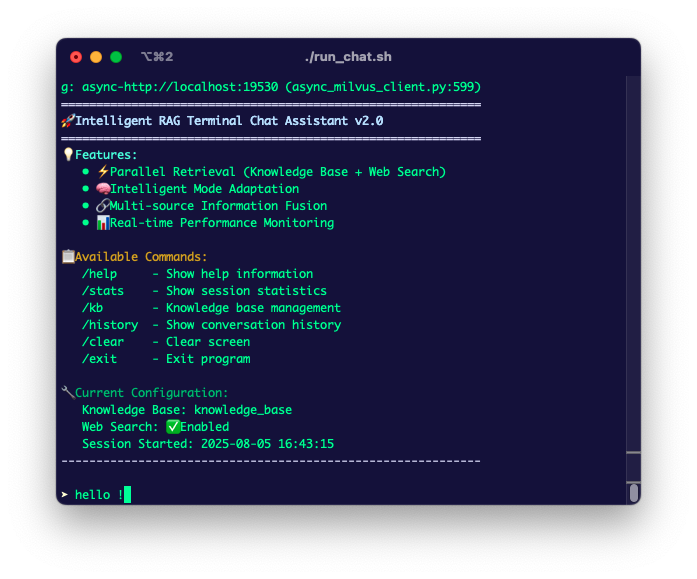
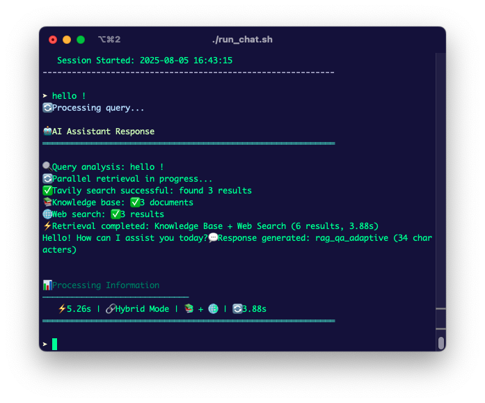
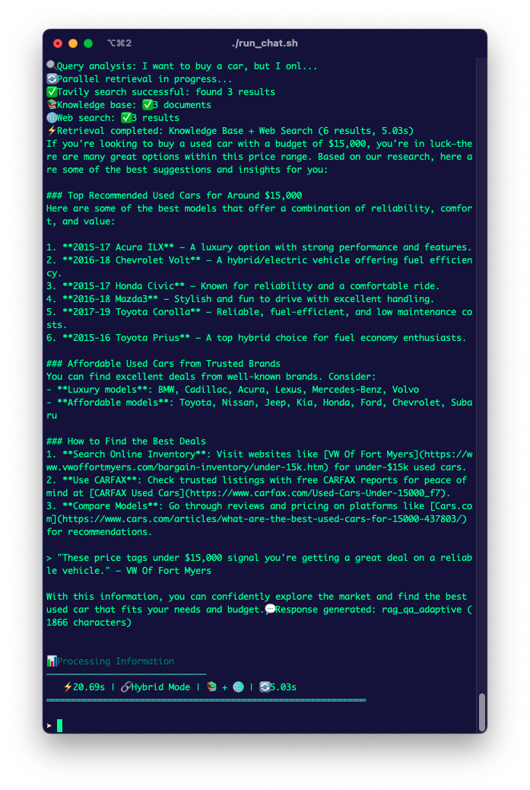

# Base Agent Engineering

<div align="center">

[](./README.md)
[](./README_CN.md)

</div>

---

## English | [中文](./README_CN.md)

**Intelligent RAG System** - High-performance Retrieval-Augmented Generation (RAG) service based on FastAPI, integrating knowledge base retrieval and web search for a hybrid intelligent assistant.

## Core Features

- **Hybrid Retrieval Strategy**: Intelligent fusion of knowledge base + web search
- **Context Engineering**: Smart context selection, compression, and optimization
- **High-Performance API**: FastAPI-based asynchronous processing with streaming response support
- **Knowledge Base Management**: Multi-format document support with intelligent chunking strategies
- **Smart Routing**: Automatic selection of optimal retrieval strategy based on query type
- **Comprehensive Evaluation**: Complete evaluation system for retrieval quality and generation effectiveness
- **Containerized Deployment**: One-click Docker deployment with vector database management interface

##  About The Project








##  Quick Start

### Requirements

- Python 3.9+
- Docker & Docker Compose
- 8GB+ RAM (16GB recommended)

### 1. Clone Repository

```bash
git clone https://github.com/your-username/base_agent_engineering.git
cd base_agent_engineering
```

### 2. Environment Configuration

```bash
# Copy environment template
cp .env.example .env

# Edit configuration file and add API keys
vim .env
```

### 3. One-Click Launch

```bash
# Start all services (including Milvus + Attu management interface)
docker-compose up -d

# Install Python dependencies
pip install -r requirements.txt

# Start RAG API service
uvicorn app.main:app --reload --host 0.0.0.0 --port 8010
```

### 4. Verify Installation

```bash
# Health check
curl http://localhost:8010/health

# Get model information
curl http://localhost:8010/api/v1/models

# Test chat functionality with car_docs knowledge base
curl -X POST "http://localhost:8010/api/v1/chat" \
  -H "Content-Type: application/json" \
  -d '{"query": "汽车发动机故障怎么处理？", "collection_name": "car_docs"}'
```

## 📖 Usage Guide

### API Endpoints

#### Basic Chat Interface

**URL**: `POST http://localhost:8010/api/v1/chat`

⚠️ **Important**: When using knowledge base functionality, you must specify the `collection_name` parameter in the request.

```bash
# Using car_docs knowledge base for automotive queries
curl -X POST "http://localhost:8010/api/v1/chat" \
  -H "Content-Type: application/json" \
  -d '{
    "query": "How to troubleshoot car engine problems?",
    "collection_name": "car_docs",
    "search_strategy": "both",
    "max_web_results": 5,
    "max_kb_results": 5
  }'

# General queries using web search only
curl -X POST "http://localhost:8010/api/v1/chat" \
  -H "Content-Type: application/json" \
  -d '{
    "query": "What is artificial intelligence?",
    "search_strategy": "web_only"
  }'
```

#### Streaming Chat Interface

**URL**: `POST http://localhost:8010/api/v1/chat/stream`

```bash
# Streaming response for automotive queries
curl -X POST "http://localhost:8010/api/v1/chat/stream" \
  -H "Content-Type: application/json" \
  -d '{
    "query": "Car brake system maintenance tips?",
    "collection_name": "car_docs"
  }' \
  --no-buffer -N

# General streaming queries
curl -X POST "http://localhost:8010/api/v1/chat/stream" \
  -H "Content-Type: application/json" \
  -d '{
    "query": "Explain the principles of deep learning",
    "search_strategy": "web_only"
  }' \
  --no-buffer -N
```

#### Knowledge Base Management

**Available Knowledge Bases**:
- `car_docs`: Automotive maintenance and repair documentation  
- `knowledge_base`: Default general knowledge base
- Other custom knowledge bases you may have created

💡 **Tip**: Use the appropriate knowledge base for your domain-specific queries to get more accurate and relevant responses.

```bash
# Get knowledge base list
curl -X GET "http://localhost:8010/api/v1/knowledge-bases"

# Switch knowledge base
curl -X POST "http://localhost:8010/api/v1/switch-kb/ai_research"
```

### Command Line Tools

#### Knowledge Base Management

```bash
# List all knowledge bases
python scripts/knowledge_base_cli.py list-kb

# Create knowledge base
python scripts/knowledge_base_cli.py create-kb tech_docs --strategy recursive

# Switch knowledge base
python scripts/knowledge_base_cli.py switch-kb tech_docs

# Delete knowledge base (with confirmation)
python scripts/knowledge_base_cli.py delete-kb tech_docs --confirm

# View knowledge base statistics
python scripts/knowledge_base_cli.py stats --collection tech_docs
```

#### Document Management

```bash
# Upload single document
python scripts/knowledge_base_cli.py add-file document.pdf --collection tech_docs --strategy semantic

# Batch upload directory
python scripts/knowledge_base_cli.py add-dir ./documents/ --collection tech_docs --strategy recursive

# Upload with custom chunking parameters
python scripts/knowledge_base_cli.py add-file document.pdf \
  --collection tech_docs \
  --strategy recursive \
  --chunk-size 1000 \
  --chunk-overlap 200
```

#### Search and Strategy Management

```bash
# Search knowledge base
python scripts/knowledge_base_cli.py search "What is machine learning" --collection tech_docs -k 10 --scores

# List available chunking strategies
python scripts/knowledge_base_cli.py list-strategies

# Get strategy recommendations
python scripts/knowledge_base_cli.py recommend-strategy --file-type pdf
python scripts/knowledge_base_cli.py recommend-strategy --use-case knowledge_base
```

#### Search Testing

```bash
# Interactive search
python -m cli search --interactive --collection tech_docs

# Single search
python -m cli search --query "What is machine learning" --collection tech_docs

# Hybrid search testing
python -m cli search --query "Latest AI developments" --hybrid
```

#### Evaluation Testing

```bash
# Retrieval quality evaluation
python -m cli eval retrieval --collection tech_docs --test-file test_queries.json

# Chunking strategy evaluation
python -m cli eval chunking --strategy semantic --test-file test_docs.json

# Generate benchmark test report
python -m cli eval report --output evaluation_report.html
```

## ⚙️ Configuration

### Environment Variables (.env)

```bash
# API service configuration
API_HOST=0.0.0.0
API_PORT=8010                       # Chat API service port
API_WORKERS=4

# Database configuration
MILVUS_HOST=localhost
MILVUS_PORT=19530
REDIS_URL=redis://localhost:6379

# API keys
TAVILY_API_KEY=your_tavily_api_key  # Web search API key

# Model configuration
DEFAULT_CHAT_MODEL=qwen-plus        # Qwen Plus model
DEFAULT_EMBEDDING_MODEL=text-embedding-v4

# Logging configuration
LOG_LEVEL=INFO
```

### Port Configuration

```bash
# Service port allocation
8010    # Chat API main service
19530   # Milvus vector database (internal)
6379    # Redis cache (internal)
```

### Model Configuration

```yaml
# config/models/chat_models.yaml
models:
  primary:
    name: "gpt-4"
    provider: "openai"
    parameters:
      temperature: 0.7
      max_tokens: 2000
    cost_per_1k_tokens: 0.03
  
  fallback:
    name: "gpt-3.5-turbo"
    provider: "openai"
    parameters:
      temperature: 0.7
      max_tokens: 1500
    cost_per_1k_tokens: 0.002
```

### Retrieval Strategy Configuration

```yaml
# config/rag/hybrid_strategy_config.yaml
retrieval_strategies:
  default:
    knowledge_base_weight: 0.7
    web_search_weight: 0.3
    max_results_per_source: 5
    
  realtime_queries:
    knowledge_base_weight: 0.3
    web_search_weight: 0.7
    
  domain_specific:
    knowledge_base_weight: 0.9
    web_search_weight: 0.1
```

## 📊 Performance Monitoring

### System Metrics

```bash
# Check system status
curl http://localhost:8010/health

# Get detailed health check
curl http://localhost:8010/api/v1/health

# View model information
curl http://localhost:8010/api/v1/models
```

### System Monitoring

**Current Service Status**:
- **Service Port**: 8010
- **Chat Model**: qwen-plus (Qwen Plus)
- **Embedding Model**: text-embedding-v4  
- **Vector Database**: Milvus
- **Available Knowledge Bases**: 5 (ai_research, knowledge_base, metadata, strategy_test, strategy_test_auto)
- **Web Search**: ✅ Enabled (Tavily)
- **Language Adaptation**: ✅ Enabled (Auto-detect user language and match response language)
- **Markdown Support**: ✅ Enabled (Supports formatted output)

## 🧪 Testing and Evaluation

### Running Tests

```bash
# Run all tests
python scripts/run_tests.py

# Or use pytest directly
pytest tests/unit/ -v

# Run specific test file
pytest tests/unit/test_config.py -v

# Generate coverage report
pytest --cov=config --cov=src --cov=app --cov-report=html
```

### Evaluation Metrics

- **Retrieval Quality**: Precision@K, Recall@K, MRR, NDCG
- **Generation Quality**: BLEU, ROUGE, Semantic Similarity
- **System Performance**: Response Time, QPS, Resource Usage
- **User Experience**: Answer Relevance, Information Completeness

## Deployment Guide

### Development Environment

```bash
# Start development server
uvicorn app.main:app --reload --host 0.0.0.0 --port 8010

# Or use uvicorn
uvicorn app.main:app --reload --host 0.0.0.0 --port 8010
```

### Production Environment

```bash
# Using Docker Compose
docker-compose -f docker-compose.prod.yml up -d

# Or using Kubernetes
kubectl apply -f deployment/k8s/
```

### Web Service Integration

If you need to deploy with other web services on the same server, you can use Nginx reverse proxy:

```nginx
# /etc/nginx/sites-available/your-site
server {
    listen 80;
    server_name your-domain.com;

    # Main web application
    location / {
        proxy_pass http://localhost:3000;  # Your main web service
        proxy_set_header Host $host;
        proxy_set_header X-Real-IP $remote_addr;
    }

    # Chat API service
    location /api/chat/ {
        proxy_pass http://localhost:8010/api/v1/;
        proxy_set_header Host $host;
        proxy_set_header X-Real-IP $remote_addr;
        proxy_set_header X-Forwarded-For $proxy_add_x_forwarded_for;
    }
}
```

### Performance Optimization

- **Concurrent Processing**: Multi-worker processes
- **Caching Strategy**: Redis caching for hot data
- **Load Balancing**: Nginx reverse proxy
- **Monitoring & Alerting**: Prometheus + Grafana

## Development Guide

### Adding New Features

1. **New Retrieval Strategy**: Implement in `src/retrieval/`
2. **New Chunking Method**: Implement in `src/knowledge_base/ingestion/`
3. **New Evaluation Metrics**: Implement in `src/evaluation/`
4. **New API Endpoints**: Implement in `app/api/`


## 🤝 Contributing

1. Fork the project
2. Create a feature branch (`git checkout -b feature/AmazingFeature`)
3. Commit your changes (`git commit -m 'Add some AmazingFeature'`)
4. Push to the branch (`git push origin feature/AmazingFeature`)
5. Open a Pull Request

## License

This project is licensed under the Apache-2.0 License - see the [LICENSE](LICENSE) file for details.

## FAQ

### Q: How to add support for new document types?
A: Add new parsers in `src/knowledge_base/ingestion/document_processor.py`.

### Q: How to optimize retrieval performance?
A: Adjust configuration files in `config/retrieval/` or use `python -m cli eval` for performance testing.

### Q: How to switch to different vector databases?
A: Modify `docker-compose.yml` and corresponding configuration files, supports Milvus, Qdrant, Weaviate, etc.

### Q: How to monitor system performance?
A: Use Attu interface to monitor Milvus, get API metrics through `/api/v1/metrics` endpoint.

### Q: What to do about port conflicts?
A: Modify port configuration in `.env` file, defaults use 8010(API) to avoid common port conflicts.

---

Related Blogs: https://chongliujia.github.io/posts/rag%E7%B3%BB%E7%BB%9F%E5%BC%82%E6%AD%A5%E8%AE%BE%E8%AE%A1%E6%9E%B6%E6%9E%84%E6%96%87%E6%A1%A3/

---

⭐ If this project helps you, please give it a Star!
