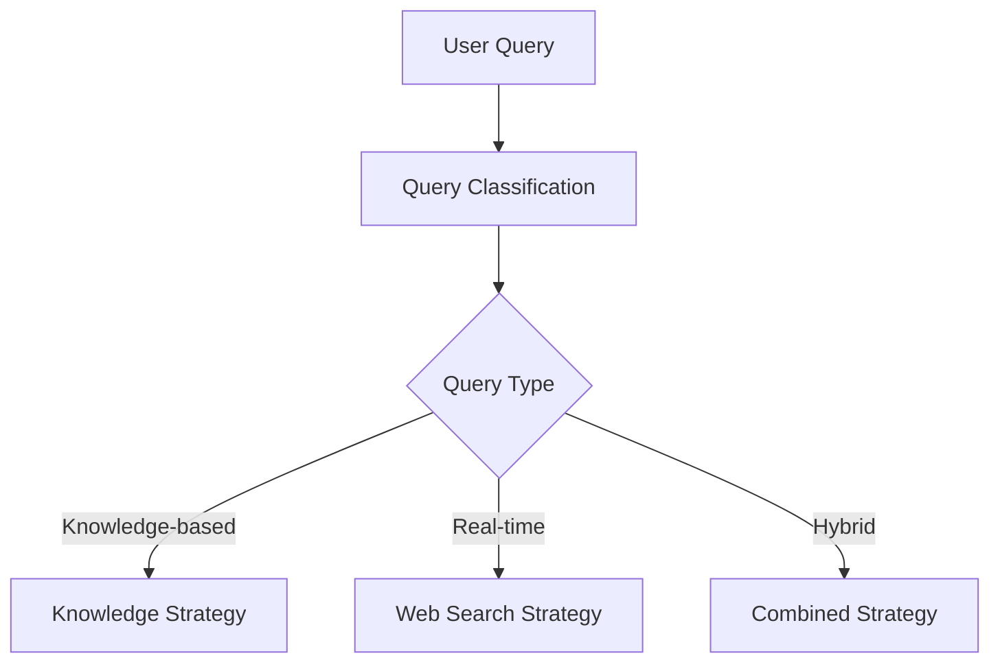
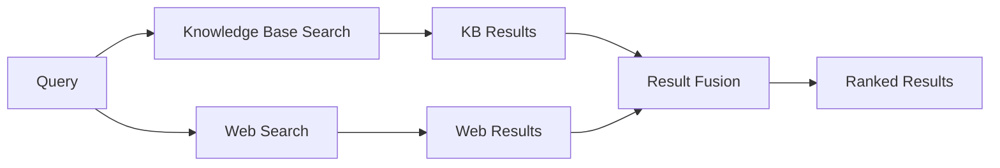

# Smart Parallel RAG Workflow

## Overview

The Smart Parallel RAG Workflow is a sophisticated retrieval-augmented generation system that combines multiple search strategies and processing techniques to provide intelligent responses. This document outlines the architecture, components, and implementation details of this advanced RAG system.

## System Architecture

### Core Components

1. **Hybrid Search Engine**
   - Knowledge Base Retrieval
   - Web Search Integration
   - Parallel Processing
   - Result Fusion

2. **Intelligent Routing**
   - Query Classification
   - Strategy Selection
   - Dynamic Adaptation

3. **Multi-Modal Processing**
   - Text Processing
   - Document Analysis
   - Context Enhancement

4. **Response Generation**
   - Template Management
   - Context Integration
   - Quality Assurance

## Workflow Process

### 1. Query Analysis Phase



**Key Features:**
- Automatic query type detection
- Language identification
- Intent classification
- Context extraction

### 2. Parallel Retrieval Phase



**Parallel Processing Benefits:**
- Reduced latency through concurrent execution
- Improved result diversity
- Enhanced reliability through redundancy
- Scalable processing architecture

### 3. Context Enhancement Phase

**Knowledge Base Processing:**
- Semantic similarity scoring
- Relevance ranking
- Content extraction
- Metadata enrichment

**Web Search Processing:**
- Content scraping and cleaning
- Reliability scoring
- Source verification
- Information extraction

### 4. Response Generation Phase

**Context Integration:**
- Multi-source information fusion
- Contradiction resolution
- Fact verification
- Source attribution

**Quality Assurance:**
- Response coherence checking
- Accuracy validation
- Completeness assessment
- Bias detection

## Technical Implementation

### LangGraph Workflow Architecture

```python
# Simplified workflow structure
class SmartRAGWorkflow:
    def __init__(self):
        self.nodes = {
            'query_analysis': self.analyze_query,
            'kb_search': self.search_knowledge_base,
            'web_search': self.search_web,
            'result_fusion': self.fuse_results,
            'response_generation': self.generate_response
        }
        
    async def analyze_query(self, state):
        # Query classification and routing logic
        pass
        
    async def search_knowledge_base(self, state):
        # Knowledge base retrieval logic
        pass
        
    async def search_web(self, state):
        # Web search integration logic
        pass
        
    async def fuse_results(self, state):
        # Result combination and ranking logic
        pass
        
    async def generate_response(self, state):
        # Response generation with context integration
        pass
```

### Asynchronous Processing

**Benefits:**
- Non-blocking I/O operations
- Improved throughput
- Better resource utilization
- Enhanced user experience

**Implementation Features:**
- Async/await pattern usage
- Thread pool integration
- Event loop management
- Error handling and recovery

### Multi-Knowledge Base Support

**Architecture:**
- Independent knowledge base collections
- Dynamic knowledge base switching
- Cross-collection search capabilities
- Metadata-driven management

**Features:**
- Collection lifecycle management
- Data isolation and security
- Concurrent access support
- Performance optimization

## Search Strategies

### 1. Knowledge-Only Strategy

**Use Cases:**
- Domain-specific queries
- Internal documentation searches
- Specialized knowledge requirements

**Advantages:**
- High relevance to specific domains
- Controlled information quality
- Fast retrieval from indexed content
- Privacy and security compliance

### 2. Web-Only Strategy

**Use Cases:**
- Current events and news
- Real-time information needs
- General knowledge queries
- Trending topics

**Advantages:**
- Access to latest information
- Broad knowledge coverage
- Dynamic content availability
- Diverse perspective sources

### 3. Hybrid Strategy

**Use Cases:**
- Complex research queries
- Comprehensive analysis needs
- Multi-faceted questions
- Knowledge validation requirements

**Advantages:**
- Best of both worlds approach
- Enhanced result diversity
- Improved accuracy through cross-validation
- Comprehensive coverage

## Performance Optimization

### Caching Strategies

1. **Query Result Caching**
   - Frequently asked questions
   - Time-based cache invalidation
   - Similarity-based cache matching

2. **Vector Embedding Caching**
   - Pre-computed embeddings
   - Incremental updates
   - Memory-efficient storage

3. **Web Content Caching**
   - Temporary content storage
   - Source reliability tracking
   - Freshness indicators

### Load Balancing

- Request distribution across multiple workers
- Dynamic scaling based on demand
- Circuit breaker patterns for reliability
- Health monitoring and failover

### Resource Management

- Memory usage optimization
- Connection pool management
- Garbage collection tuning
- Resource cleanup automation

## Quality Assurance

### Content Validation

1. **Source Credibility Assessment**
   - Domain authority scoring
   - Publisher reputation analysis
   - Content freshness evaluation

2. **Information Accuracy Checking**
   - Cross-source verification
   - Fact-checking integration
   - Confidence scoring

3. **Bias Detection and Mitigation**
   - Perspective diversity analysis
   - Balanced viewpoint presentation
   - Neutrality indicators

### Response Quality Metrics

- **Relevance Score**: How well the response addresses the query
- **Completeness Score**: Coverage of important aspects
- **Coherence Score**: Logical flow and consistency
- **Accuracy Score**: Factual correctness assessment
- **Source Diversity**: Variety of information sources

## Monitoring and Analytics

### Performance Metrics

- Query processing time
- Retrieval accuracy rates
- User satisfaction scores
- System resource utilization
- Error rates and recovery times

### Usage Analytics

- Query pattern analysis
- Popular topics identification
- User behavior insights
- Knowledge gap detection

### System Health Monitoring

- Component availability tracking
- Performance threshold alerts
- Automated recovery procedures
- Capacity planning data

## Integration Capabilities

### API Integration

- RESTful API endpoints
- GraphQL query support
- Webhook notifications
- SDK availability

### Third-Party Services

- Search engine APIs
- Knowledge graph services
- Content delivery networks
- Authentication providers

### Custom Extensions

- Plugin architecture support
- Custom retrieval strategies
- Domain-specific processors
- Integration middleware

## Security Considerations

### Data Protection

- Encryption at rest and in transit
- Access control and authentication
- Data anonymization capabilities
- Compliance with privacy regulations

### Query Sanitization

- Input validation and filtering
- SQL injection prevention
- XSS attack mitigation
- Rate limiting and throttling

### Source Verification

- SSL certificate validation
- Domain whitelist/blacklist
- Content integrity checking
- Malicious content detection

## Future Enhancements

### Planned Features

1. **Multi-Modal Support**
   - Image and video processing
   - Audio content analysis
   - Document structure recognition

2. **Advanced AI Integration**
   - Custom model fine-tuning
   - Reinforcement learning from feedback
   - Contextual understanding improvements

3. **Enhanced Personalization**
   - User preference learning
   - Personalized result ranking
   - Adaptive response formatting

4. **Collaborative Features**
   - Shared knowledge bases
   - Collaborative filtering
   - Community-driven improvements

### Research Directions

- Federated learning approaches
- Quantum computing integration
- Neuromorphic processing exploration
- Advanced natural language understanding

---

**Last Updated**: 2025-07-31
**Version**: 2.0
**Documentation Status**: Complete